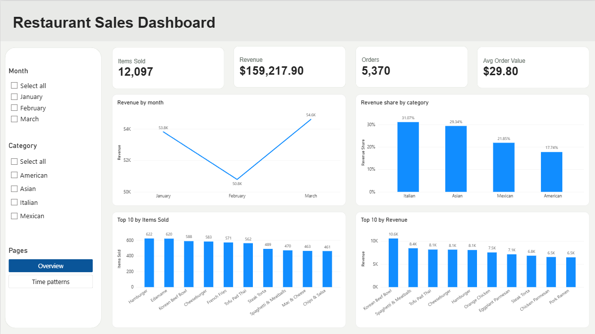
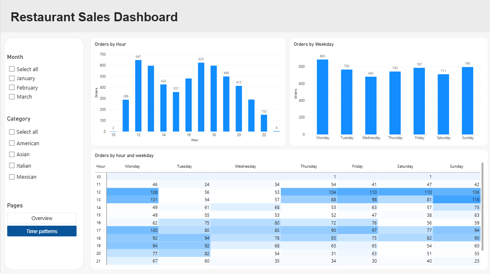

# Restaurant Orders Analysis (SQL + Power BI)
I analysed three months of restaurant orders (January–March 2023) to find out what sells best, when customers order, and where the restaurant could earn more. I used SQL Server to answer the questions and Power BI to build a two-page dashboard.



## Contents

- [The Problem](#the-problem)
- [Key Findings](#key-findings)
- [Quick Numbers](#quick-numbers)
- [Dataset](#dataset)
- [Tools](#tools)
- [How I Built It](#how-i-built-it)
- [Results](#results)
- [Power BI Dashboard](#power-bi-dashboard)
- [Challenges](#challenges)
- [Recommendations](#recommendations)
- [Project Structure](#project-structure)
- [How to Run It](#how-to-run-it)
- [Conclusion](#conclusion)

## The Problem

A restaurant has a lot of order data, but a list of orders does not tell you much on its own. I wanted to answer questions that a restaurant manager might ask:

**Menu**
- Which dishes are ordered most often?
- Which dishes generate the most revenue?
- Which menu items are underperforming?

**Orders**
- How many items does a customer usually order?
- Which orders have the highest total value?

**Revenue**
- How much revenue does each category generate?
- How does revenue change from month to month?

**Time**
- What are the busiest ordering hours?
- Which weekdays have the highest demand?
- When does the restaurant need more staff?

## Key Findings
- **Revenue:** The restaurant generated $159.2K in revenue. Italian and Asian dishes accounted for 60.4% of the total.
- **Order size:** 83.5% of orders contained 1–3 items, with an average of 2.3 items per order.
- **Popular dishes:** Hamburger and Edamame had the highest order counts, while Korean Beef Bowl generated the most revenue.
- **Peak hours:** Demand was highest around lunch (12:00–13:00) and dinner (17:00–19:00).

## Quick Numbers

| Total Revenue | Total Orders | Items Sold | Avg. Order Value | Avg. Items per Order |
|---|---|---|---|---|
| $159.2K | 5,370 | 12,097 | $29.80 | 2.3 |

**Period:** 1 January – 31 March 2023
**Menu:** 32 dishes in 4 categories (American, Asian, Italian, Mexican)

## Dataset

[Restaurant Orders](https://mavenanalytics.io/data-playground/restaurant-orders) from Maven Analytics. It has two tables:

| Table | What it contains |
|---|---|
| `menu_items` | Dish name, category and price |
| `order_details` | One row per ordered item, with order ID, date and time |

## Tools

- Microsoft SQL Server Management Studio (SSMS)
- SQL
- Power BI Desktop
- GitHub

## How I Built It

**1. SQL analysis**

I created the database and loaded both tables (`create_restaurant_db.sql`). Then I wrote the queries for each question (`restaurant_analysis.sql`). The queries use:

- `WHERE`, `GROUP BY`, `HAVING`, `ORDER BY` and aggregate functions (`COUNT`, `SUM`, `AVG`, `MIN`, `MAX`)
- `INNER JOIN` and `LEFT JOIN`
- Subqueries and CTEs
- `CASE WHEN` (for example, to group orders into small, medium and large)
- Window functions: `RANK()`, `LAG()`, `SUM() OVER()`
- `DATEPART` and `DATENAME` (to get the hour and weekday)

**2. Power BI dashboard**

I loaded the same data into Power BI and connected the two tables. Then I wrote a few measures and built two report pages. More details are in the [dashboard section](#power-bi-dashboard).


## Results

### 1. Menu

**Most and least expensive items** 

| item_name | price | type |
|---|---|---|
| Shrimp Scampi | 19.95 | most expensive |
| Edamame | 5.00 | cheapest |

The most expensive dish is Shrimp Scampi ($19.95). The cheapest is Edamame ($5.00).

**Average price by category**

| Category | Dishes | Average price |
|---|---|---|
| American | 6 | $10.07 |
| Asian | 8 | $13.48 |
| Italian | 9 | $16.75 |
| Mexican | 9 | $11.80 |

Italian dishes have the highest average price, while American dishes are the cheapest on average.

**Most and least ordered dishes**

| Dish | Category | Times ordered |
|---|---|---|
| Hamburger | American | 622 |
| Edamame | Asian | 620 |
| ... | ... | ... |
| Chicken Tacos | Mexican | 123 |

Edamame is the cheapest menu item at $5.00 but is also the second most ordered dish, suggesting strong customer demand for low-priced starters or sides. Chicken Tacos, with only 123 orders, is the weakest performer by order volume.

**Top 3 dishes by revenue in each category**

| Category | Dish | Revenue |
|---|---|---|
| American | Cheeseburger | $8,132.85 |
| American | Hamburger | $8,054.90 |
| American | French Fries | $3,997.00 |
| Asian | Korean Beef Bowl | $10,554.60 |
| Asian | Tofu Pad Thai | $8,149.00 |
| Asian | Orange Chicken | $7,524.00 |
| Italian | Spaghetti & Meatballs | $8,436.50 |
| Italian | Eggplant Parmesan | $7,119.00 |
| Italian | Chicken Parmesan | $6,533.80 |
| Mexican | Steak Torta | $6,821.55 |
| Mexican | Chicken Burrito | $5,892.25 |
| Mexican | Steak Burrito | $5,292.30 |

Korean Beef Bowl is the highest-revenue dish in the menu. The American category also shows an interesting difference between popularity and revenue: Hamburger is ordered more frequently, while Cheeseburger generates more revenue because of its higher price.

### 2. Orders

**Order Overview**

| Metric | Value |
|---|---|
| Total orders | 5,370 |
| Total items sold | 12,097 |
| Average items per order | 2.3 |
| Average order value | $29.80 |
| Largest order | 14 items |
| Orders with 12 or more items | 20 |

**Order size distribution**

| Size | Orders | Share |
|---|---|---|
| Small (1–3 items) | 4,486 | 83.5% |
| Medium (4–8 items) | 797 | 14.8% |
| Large (9+ items) | 87 | 1.6% |

The vast majority of orders contain only 1–3 items. This represents a potential opportunity to increase average order value through combo meals, side-dish recommendations, drink add-ons or dessert promotions.

### 3. Revenue

**Monthly revenue**

| Month | Revenue | Change from last month | Running total |
|---|---|---|---|
| January | $53,816.95 | – | $53,816.95 |
| February | $50,790.35 | -$3,026.60 (-5.6%) | $104,607.30 |
| March | $54,610.60 | +$3,820.25 (+7.5%) | $159,217.90 |

February generated the lowest revenue, while March was the strongest month. The February decline is partly explained by the shorter month. 

**Revenue share by category**

| Category | Share |
|---|---|
| Italian | 31.1% |
| Asian | 29.3% |
| Mexican | 21.9% |
| American | 17.7% |

Italian and Asian dishes bring in 60.4% of revenue. American dishes are among the most popular by order volume, but their lower prices mean they contribute the smallest share of revenue.

**Highest-Value Orders**

| Order ID | Total |
|---|---|
| 440 | $192.15 |
| 2075 | $191.05 |
| 1957 | $190.10 |
| 330 | $189.70 |
| 2675 | $185.10 |

The highest-value order was $192.15 and contained 14 items, including 8 Italian dishes.

### 4. Demand & Time Analysis

**Busiest Ordering Hours**

| Hour | Orders |
|---|---|
| 12:00 | 647 |
| 17:00 | 623 |
| 18:00 | 596 |
| 13:00 | 595 |
| 19:00 | 498 |

**Orders by weekday**

| Weekday | Orders |
|---|---|
| Monday | 885 |
| Sunday | 796 |
| Friday | 787 |
| Tuesday | 766 |
| Thursday | 743 |
| Saturday | 711 |
| Wednesday | 682 |

Lunch (12:00-13:00) accounts for 23% of orders and dinner (17:00-19:00) for 32%. Orders after 22:00 are very rare. Monday is the busiest weekday with 885 orders, while Wednesday has the lowest demand with 682 orders.


## Power BI Dashboard

The dashboard uses the same data as the SQL analysis. It consists of two pages, providing an overview of sales performance and a closer look at ordering patterns.

**Overview** shows revenue, orders, items sold and average order value, with revenue by month and category and the top 10 dishes by items sold and by revenue.


**Time patterns** shows orders by hour and by weekday, and a heatmap of hour × weekday.  



Month and category slicers filter both pages.

**Data model:** `menu_items` (one) is connected to `order_details` (many) with `menu_item_id` = `item_id`.

**DAX measures:**

```
Revenue = SUMX(order_details, RELATED(menu_items[price]))
Orders = DISTINCTCOUNT(order_details[order_id])
Items Sold = COUNT(order_details[item_id])
Orders With Items =
    CALCULATE(
        DISTINCTCOUNT(order_details[order_id]),
        FILTER(order_details, NOT(ISBLANK(order_details[item_id])))
    )
Avg Order Value = DIVIDE([Revenue], [Orders With Items])
```

Average order value only counts orders that have at least one item.

## Challenges

**Rows with no item.** Some rows in `order_details` have an empty `item_id`, so they cannot be matched to a menu item or a price. I excluded these rows from item counts and revenue calculations. In Power BI, I created a separate `Orders With Items` measure to count only orders containing valid items when calculating the average order value.

## Recommendations

**1. Promote Italian and Asian dishes**

They bring in 60.4% of revenue. The restaurant could give them more space on the menu and push the best sellers: Korean Beef Bowl, Spaghetti & Meatballs and Tofu Pad Thai.

**2. Look at weak dishes**

Chicken Tacos had only 123 orders. The restaurant could try a new price, a new recipe, a better place on the menu or a special offer. If nothing helps, it could replace the dish.

**3. Raise the average order value**

Since 83.5% of orders have only 1–3 items, the restaurant could offer combo meals, main + side bundles, drinks and desserts.

**4. Plan staff around busy times**

Add more staff at 12:00–13:00 and 17:00–19:00. Monday may also need extra staff because it has the most orders.

## Project Structure

```
restaurant-orders-analysis/
├── Dashboard/
│   ├── restaurant_dashboard.pbix
│   ├── dashboard_overview.png
│   └── dashboard_time.png
├── restaurant_analysis.sql
└── README.md
```

## How to Run It

1. Download the [Restaurant Orders](https://mavenanalytics.io/data-playground/restaurant-orders) dataset from Maven Analytics.
2. Open SQL Server Management Studio and run `create_restaurant_db.sql` to create the database and load the data.
3. Run `restaurant_analysis.sql` to get the SQL results.
4. Open `Dashboard/restaurant_dashboard.pbix` in Power BI Desktop to explore the dashboard.


## Conclusion

This project gave me practical experience in using SQL to analyse sales data and Power BI to communicate the results visually. It helped me practise aggregations, joins, CTEs, window functions, data modelling and DAX measures while exploring menu performance and customer ordering patterns.


